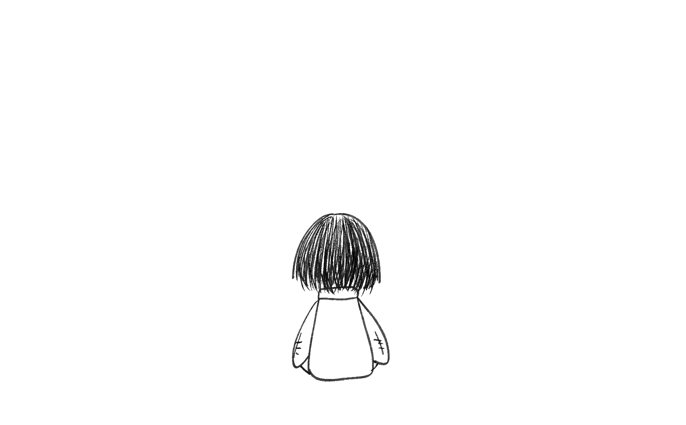

# Twenty Steps (MVP)

Just a persistent piece of junk.
20단계 기획 중 10단계까지 구현된 MVP 버전입니다.

## 🔗 Live Demo

[https://your-project-name.vercel.app](https://your-project-name.vercel.app)

## ⚠️ Warning

- 본 프로젝트는 **보는 사람에 따라 불쾌함을 유발할 수 있는 연출**을 포함하고 있습니다.
- 이용 시 이 점 유의하시기 바랍니다.

## 🖼 Preview

  

## 🛠 Tech Stack

- **Framework:** React (Vite)
- **Animation:** Framer Motion
- **Styling:** CSS (Transitions & Filters)

## 📜 License & Copyright

- **Assets:** 모든 그림 자산은 **Yoo**가 직접 제작(Procreate)하였으며, 이미지의 무단 전재 및 상업적 이용을 금합니다.
- **Libraries:** 본 프로젝트에서 사용된 아래 라이브러리들은 MIT 라이선스를 따릅니다.
  - `react`, `framer-motion`, `vite`
